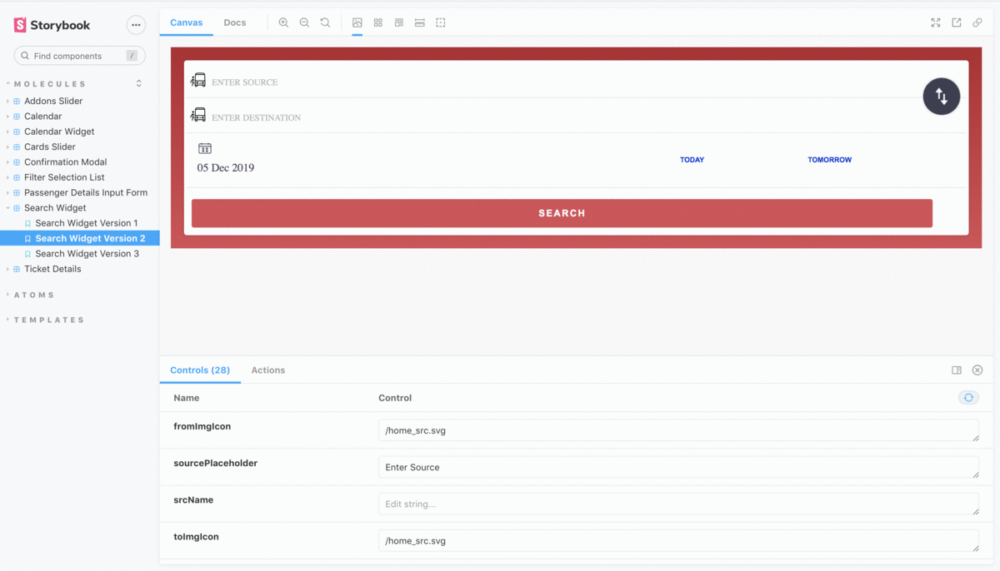

  rbComponentLibrary

A common goal that is shared by all Frontend developers and teams everywhere is to be able to design and develop components that enable them to ship out their features with the focus of,

1. Improved productivity
2. UI consistency
3. Lesser bugs in the production

At **_redBus_**, we decided to create a reusable component library across the teams that would aid developers in building UIs seamlessly and more efficiently.

There are many approaches currently being followed as part of the industry standards, to build a component library. We used **_React Storybook_**.

>Storybook is a tool/framework used for UI development which allows you to build isolated and reusable components that can be leveraged to develop entire UIs without much effort.

**Storybook** is a visual playground for our react components, enabling us to see our components in action and debug them as well.

Inspired by the [Atomic Design Methodology (by Brad Frost)](https://atomicdesign.bradfrost.com/chapter-2/), we have contributed to adding multiple UI components that are isolated and reusable, in other words, Atoms.

We have fully embraced the Atomic Design Approach by combining the Atoms to form Molecules, which can be combined to form organisms and further, templates.

## Setup
* git clone https://github.com/redbus-labs/rbComponentLibrary
* cd rbComponentLibrary/
* npm install
* npm run storybook
* once storybook is running, please check http://localhost:6006/

